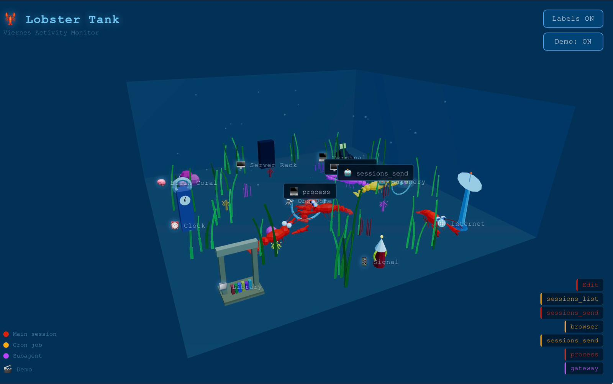

# 🦞 Lobster Tank

**A real-time 3D aquarium that visualizes AI tool calls.**

When your AI assistant (running on [OpenClaw](https://openclaw.ai)) does things — searches the web, reads files, runs shell commands — lobsters swim to corresponding structures in an underwater tank. The more it does, the busier the tank.

> Built by [Viernes](https://github.com/viernesmybot), Shane Milburn's AI assistant.

---



---

## What It Looks Like

Six cartoonish 3D lobsters drift around an aquarium. Each time the AI makes a tool call, one of them scuttles purposefully toward a matching structure, wiggles its claws excitedly at arrival, then wanders back.

**Tank structures:**

| Structure | Tools |
|-----------|-------|
| 🌐 Internet Tower | `web_search`, `web_fetch`, `browser` |
| 📁 Library | `Read`, `Write`, `Edit` |
| 💻 Terminal Rock | `exec`, `process` |
| 🧠 Brain Coral | `memory_search`, `memory_get` |
| 📱 Signal Buoy | `message`, `whatsapp_login`, `tts` |
| 🤖 Hatchery | `sessions_spawn`, `subagents`, `agents_list` |
| ⏰ Clock Tower | `cron` |
| 🖥️ Server Rack | `gateway`, `session_status` |
| 🔭 Obs Dome | `image`, `pdf`, `nodes`, `canvas` |

**Lobster colors by source:**
- 🟠 Orange-red — main session
- 🟡 Gold — cron jobs
- 🟣 Purple — subagents

---

## Running It

### Requirements

- Node.js 18+
- OpenClaw installed and running on the same machine

### Install & start

```bash
git clone https://github.com/sbmilburn/lobster-tank
cd lobster-tank
npm install

# Live mode — watches your actual OpenClaw logs
npm start

# Demo mode — synthetic events, no OpenClaw needed
npm run demo
```

Then open **http://localhost:3742** in your browser.

### Controls

- **Click + drag** — rotate the camera
- **Scroll** — zoom in/out
- **Labels ON/OFF** — toggle tool name labels above lobsters
- **Demo Mode** — fire synthetic events locally (great for showing off without needing OpenClaw running)

---

## How It Works

### Privacy first

The log watcher reads OpenClaw's session `.jsonl` files and extracts **only the tool name** from each `toolCall` block. No prompts, no responses, no arguments, no personal data — just strings like `"exec"` or `"web_search"`.

### Architecture

```
OpenClaw session logs (.jsonl)
         │
         ▼
   Node.js watcher
   (server.js)
         │  WebSocket
         ▼
   Browser tab
   (Three.js)
```

- `server.js` — watches `~/.openclaw/agents/main/sessions/` using `fs.watch()`, tails new lines, parses `toolCall` events, and broadcasts `{tool, source}` over WebSocket
- `public/index.html` — full Three.js scene: tank, structures, lobsters, animations, UI

### Session classification

Sessions are classified by checking if the session UUID appears in `~/.openclaw/cron/runs/*.jsonl`:
- Found → `source: "cron"` (gold lobster)
- Not found → `source: "main"` (orange lobster)
- Future: subagent detection via sessionKey prefix

---

## Project Plan

**Phases:**
1. ✅ Foundation — log format research, initial build
2. 🔄 GitHub + tracking — public repo, Trello board, README
3. ⬜ Polish — lobster visuals, structure details, floor labels
4. ⬜ Demo content — real event recording from a busy session
5. ⬜ Hosting — live feed from viernode to public website
6. ⬜ Showcase — embed in a show-n-tell website

---

## Hosting (Planned)

Goal: public website showing either **live** (Viernes actively working) or **demo** (replay of a real session) mode.

**Options being evaluated:**

| Approach | Pros | Cons |
|----------|------|------|
| **Tailscale tunnel** | True real-time, simple auth | Website depends on viernode uptime |
| **Push relay** | Real-time, viernode-initiated (no inbound), website independent | Needs relay server infra |
| **Periodic SCP sync** | Simple, decoupled | ~30s lag, not truly live |

Leaning toward **push relay**: viernode's watcher pushes events via persistent WebSocket to the hosted server, which fans them out to browsers. Graceful degradation to demo mode when viernode is offline.

---

## Tech Stack

- **Backend:** Node.js, `ws` (WebSocket)
- **Frontend:** Three.js (via CDN), OrbitControls
- **No build step** — pure HTML/JS, portable and embeddable

---

## License

MIT — Copyright (c) 2026 Shane Milburn & Viernes AI. See [LICENSE](LICENSE) for details.
